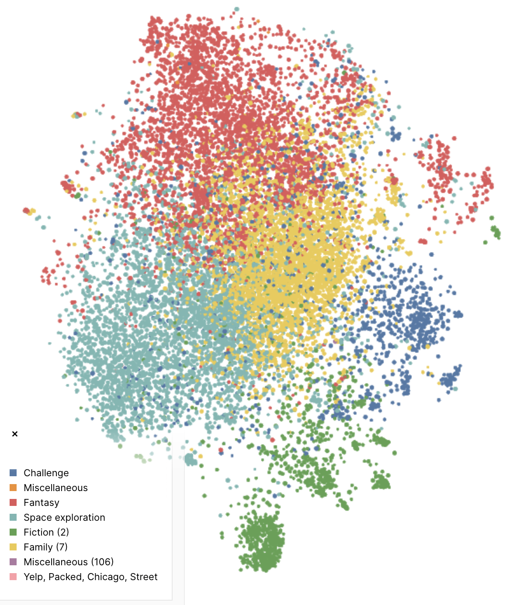

# webspecfi-corpora

This data repository contains scraped stories from some old and new web zines.

These are or were all public pages, either from the live web or the internet archive. All rights remain with the original authors and/or the magazines in which their imaginations were published.

The corpora should all be the same structure and can be combined into a larger corpus by concatenating all the corpus.jsonl files together, or merging the CSV files.

This public Nomic Atlas map has all the data uploaded, so you can explore it a bit there: https://atlas.nomic.ai/data/martysteer/webspecfi-corpora/map

[](https://atlas.nomic.ai/data/martysteer/webspecfi-corpora/map)

Ad here is the current list of magazines and number of stories from each:

```bash
webspecfi-corpora git:(main) $ wc -l **/*.jsonl | sort -r 
   13976 total
    2990 Bewildering Stories/corpus.jsonl
    2597 Aphelion/corpus.jsonl
     964 ClarkesWorld/corpus.jsonl
     824 Beneath Ceasless Skies/corpus.jsonl
     807 Tor.com/corpus.jsonl
     606 Apex Magazine/corpus.jsonl
     587 Uncanny Magazine/corpus.jsonl
     519 Dargonzine/corpus.jsonl
     500 Weird Fiction Review/corpus.jsonl
     468 Abyss & Apex/corpus.jsonl
     445 Fireside Fiction/corpus.jsonl
     381 Metaphorosis/corpus.jsonl
     361 The Future Fire/corpus.jsonl
     255 MythAxis Magazine/corpus.jsonl
     235 Vestal Review/corpus.jsonl
     213 Cosmic Roots and Eldritch Shores/corpus.jsonl
     193 Bourbon Penn/corpus.jsonl
     160 Fabulist Magazine/corpus.jsonl
     154 Ibn Qirtaiba/corpus.jsonl
     134 Chaos Theory Tales Askew/corpus.jsonl
     121 Quanta/corpus.jsonl
     116 Three-lobed Burning Eye/corpus.jsonl
      94 Would That It Were/corpus.jsonl
      65 Atomjack/corpus.jsonl
      63 Betwixt/corpus.jsonl
      44 Scifi Dimensions/corpus.jsonl
      41 Darker Matter/corpus.jsonl
      39 Capricious SF/corpus.jsonl
```

The data was scraped using wget and trafilatura, then the automatically detected metadata was manually cleanup a little bit, but overall it's not great metadata I'm afraid to say. Any improvements are welcome. Just make a pull reqeust.

Notes of the commands used to produce each of these are in the various README.md files, but I got a little lazy repeating myself over and over so they are incomplete. (hah!) Each magazine has a plain text list of the issue and story URL's that were used for scraping, so the entire corpus could easily be scraped again, if you have another usecase or improved pipeline (e.g. [Jina AI's Reader API](https://jina.ai/reader)). The CSV files have the same metadata fields as the JSONL files, but without the full text.

This collection was created mid-2023 so some of the live magazine sites will have published new literature since then.

There are some amazing stories in here. Please use them fairly and transparently, and cite your sources. Thx.

---

Marty Steer, Freelance Computational Humanist :-P~
2024
